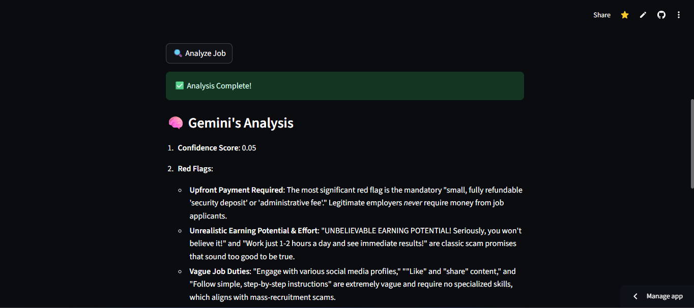

# 🧠 FakeOut – AI-Powered Fake Job Detector


FakeOut is an AI-powered tool that helps job seekers **detect fake job listings** with high accuracy. Simply paste the job description or upload a `.txt` file, and get instant feedback, red flag highlights, and a confidence score. No sign-up required. Fully privacy-first.

---

## 🚀 Try It Out

Paste or upload a job description and click "Analyze". You'll get:
- A confidence score (e.g., 0.98 = likely real)
- Highlighted red flags
- A comparison with a real job listing
- AI-generated verdict and tips

---

## 💡 Features

- ✅ AI-powered scam detection (LLM + NLP)
- 📊 Confidence scoring
- 🔍 Red flag detection (vague language, no company info, etc.)
- 🆚 Real job comparison
- 🔒 100% private (no login, no tracking)

---

## 🛠️ Built With

- [Streamlit](https://streamlit.io/)
- [Google Gemini](https://ai.google.dev/)
- Python (regex, NLP)

---

## 🧠 Why This Project?

Fake job listings are a growing issue, particularly for fresh graduates and remote workers. We built FakeOut to bring **trust, safety, and clarity** to job seekers — with a simple, free, and effective AI tool.

---

## 📷 Screenshots




---

## 📂 Project Structure

```bash
├── app.py # Main Streamlit app
├── prompts.py # LLM prompt templates
├── assets/ # Logo, banner, visuals
├── examples/ # Sample job listings
└── .streamlit/
```

---

## 📦 Run Locally

```bash
uv venv
source .venv/bin/activate
uv pip install -r requirements.txt

# Add your API key to .streamlit/secrets.toml

# Run:
streamlit run main.py

```

---

# 🙋‍♂️ Author
Built solo by DeadpoolX7 🧠
Connect: [Linkedin](https://linkedin.com/in/sanju-shaw-225ab4214/)

---

## 📜 License

MIT © 2025

---

## 🤝 Contributing

This was built as part of [Youth Coders Hack 2025](https://youth-coders-hack.devpost.com/). Contributions are welcome post-hackathon.

